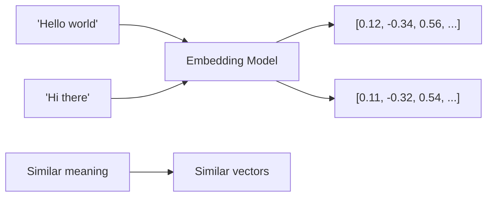

# Embeddings

Embeddings are dense vector representations of text that capture semantic meaning. Liath uses embeddings to enable semantic search across your data.

## Overview

An embedding transforms text into a fixed-size vector where semantically similar texts have similar vectors:



## Built-in Embedding Model

Liath uses FastEmbed with ONNX runtime for efficient CPU-based embedding generation.

### Default Model

**BAAI/bge-small-en-v1.5**

| Property | Value |
|----------|-------|
| Dimensions | 384 |
| Language | English |
| Model Size | ~130MB |
| Speed | ~50 texts/sec (CPU) |
| Max Tokens | 512 |

```rust
use liath::EmbeddingWrapper;

// Default model
let embedder = EmbeddingWrapper::new()?;

// Generate single embedding
let vector = embedder.generate_one("Hello, world!")?;
println!("Dimensions: {}", vector.len());  // 384

// Batch generation (more efficient)
let texts = vec!["First text", "Second text", "Third text"];
let vectors = embedder.generate(texts)?;
```

## Available Models

### Model Options

| Model | Dimensions | Size | Language | Best For |
|-------|------------|------|----------|----------|
| `BGESmallENV15` | 384 | 130MB | English | General purpose, fast |
| `BGEBaseENV15` | 768 | 440MB | English | Higher quality |
| `AllMiniLML6V2` | 384 | 91MB | English | Lightweight |
| `ParaphraseMLMiniLML12V2` | 384 | 120MB | Multilingual | Non-English |

### Using Different Models

```rust
use liath::EmbeddingWrapper;
use fastembed::EmbeddingModel;

// BGE-base for higher quality
let embedder = EmbeddingWrapper::with_model(EmbeddingModel::BGEBaseENV15)?;

// Multilingual model
let embedder = EmbeddingWrapper::with_model(EmbeddingModel::ParaphraseMLMiniLML12V2)?;
```

### Custom Options

```rust
use fastembed::{InitOptions, EmbeddingModel};

let options = InitOptions {
    model_name: EmbeddingModel::BGESmallENV15,
    show_download_progress: true,
    cache_dir: PathBuf::from("./model_cache"),
    ..Default::default()
};

let embedder = EmbeddingWrapper::with_options(options)?;
```

## Using Embeddings in Liath

### Store with Embedding

```rust
// Automatically generates embedding and stores both text and vector
db.store_with_embedding(
    "documents",     // namespace
    1,               // id
    b"doc:1",        // key for content storage
    "Document text"  // text to embed
)?;
```

### Manual Embedding

```rust
// Generate embedding separately
let embedding = db.generate_embedding("Text to embed")?;

// Store vector manually
db.add_vector("documents", 1, &embedding)?;

// Store content separately
db.put("documents", b"doc:1", b"Text to embed")?;
```

### Batch Embedding

```rust
let texts = vec![
    "First document",
    "Second document",
    "Third document",
];

// Batch is more efficient than individual calls
let embeddings = db.generate_embeddings(&texts)?;

for (i, emb) in embeddings.iter().enumerate() {
    db.add_vector("docs", i as u64, emb)?;
}
```

### Via Lua

```lua
-- Generate embedding
local vec = embed("Hello, world!")
print("Dimensions:", #vec)

-- Store with embedding
store_with_embedding("docs", "doc1", "Document content")

-- Batch generation
local texts = {"First", "Second", "Third"}
local vectors = generate_embedding(texts)
```

## Embedding Quality

### What Makes Good Embeddings

1. **Semantic Similarity**: Similar meanings → similar vectors
2. **Consistency**: Same text → same vector
3. **Discrimination**: Different meanings → different vectors

### Testing Quality

```lua
-- Test semantic similarity
local function test_similarity(text1, text2)
    local results = semantic_search("test", text1, 10)

    -- Store text2 first
    store_with_embedding("test", "t2", text2)

    -- Search for text1
    local results = semantic_search("test", text1, 1)

    return results[1].distance
end

-- Similar concepts should have low distance
local dist1 = test_similarity("car", "automobile")  -- Should be low
local dist2 = test_similarity("car", "banana")      -- Should be high
```

## Performance Optimization

### Batch Processing

Always prefer batch operations:

```rust
// Slow: individual calls
for text in texts {
    let emb = db.generate_embedding(&text)?;
}

// Fast: batch call
let embeddings = db.generate_embeddings(&texts)?;
```

### Caching Embeddings

Store embeddings to avoid regenerating:

```lua
local function get_or_create_embedding(text, cache_ns)
    local cache_key = "emb:" .. md5(text)
    local cached = get(cache_ns, cache_key)

    if cached then
        return json.decode(cached)
    end

    local emb = embed(text)
    put(cache_ns, cache_key, json.encode(emb))
    return emb
end
```

### Concurrency Control

Embedding generation is CPU-intensive. Liath uses a semaphore to limit concurrent operations:

```rust
// Configure max concurrent embeddings
let executor = QueryExecutor::new(
    namespace_manager,
    embedding_wrapper,
    lua_vm,
    file_storage,
    auth_manager,
    10  // max concurrent embeddings
);
```

## Dimension Matching

!!! warning "Critical"
    Namespace dimensions must match embedding model dimensions.

```rust
// CORRECT: dimensions match model output
db.create_namespace("docs", 384, MetricKind::Cos, ScalarKind::F32)?;  // 384 for BGE-small

// WRONG: dimension mismatch will cause errors
db.create_namespace("docs", 768, MetricKind::Cos, ScalarKind::F32)?;  // 768 won't work with 384-dim model
```

### Checking Dimensions

```rust
// Verify at startup
let test_emb = db.generate_embedding("test")?;
println!("Model dimensions: {}", test_emb.len());

// Create namespace with matching dimensions
db.create_namespace("docs", test_emb.len(), MetricKind::Cos, ScalarKind::F32)?;
```

## Text Preprocessing

### Truncation

Models have maximum token limits. Long texts are truncated:

```rust
// BGE models: 512 tokens max (~2000 characters)
let long_text = "...very long text...";  // If > 512 tokens, truncated

// For long documents, chunk first
fn chunk_text(text: &str, chunk_size: usize) -> Vec<String> {
    text.chars()
        .collect::<Vec<_>>()
        .chunks(chunk_size)
        .map(|c| c.iter().collect())
        .collect()
}
```

### Cleaning

Clean text for better embeddings:

```lua
local function clean_text(text)
    -- Remove extra whitespace
    text = text:gsub("%s+", " ")
    -- Remove special characters
    text = text:gsub("[%c]", "")
    -- Trim
    text = text:match("^%s*(.-)%s*$")
    return text
end

store_with_embedding("docs", id(), clean_text(raw_text))
```

## Embedding Patterns

### Document Chunking

For long documents, create embeddings for chunks:

```lua
local function store_document(doc_id, content, chunk_size)
    local chunks = split_into_chunks(content, chunk_size)

    for i, chunk in ipairs(chunks) do
        local chunk_id = doc_id .. ":chunk:" .. i
        store_with_embedding("docs", chunk_id, chunk)

        -- Store metadata
        put("docs:meta", chunk_id, json.encode({
            doc_id = doc_id,
            chunk_index = i,
            total_chunks = #chunks
        }))
    end
end
```

### Query Expansion

Improve recall by searching multiple phrasings:

```lua
local function expanded_search(query, k)
    local queries = {
        query,
        "What is " .. query,
        query .. " meaning",
        query .. " definition"
    }

    local all_results = {}
    local seen = {}

    for _, q in ipairs(queries) do
        local results = semantic_search("docs", q, k)
        for _, r in ipairs(results) do
            if not seen[r.id] then
                seen[r.id] = true
                table.insert(all_results, r)
            end
        end
    end

    table.sort(all_results, function(a, b) return a.distance < b.distance end)
    return slice(all_results, 1, k)
end
```

### Passage Embedding

For Q&A, embed questions and passages differently:

```lua
-- Passage prefix (for stored content)
local function embed_passage(text)
    return embed("passage: " .. text)
end

-- Query prefix (for search queries)
local function embed_query(text)
    return embed("query: " .. text)
end

-- Store passages
store_vector("qa", "p1", embed_passage("The capital of France is Paris."))

-- Search with query
local query_vec = embed_query("What is the capital of France?")
local results = vector_search("qa", query_vec, 5)
```

## Troubleshooting

### Model Download Failed

**Symptom:** Error loading embedding model

**Solutions:**

1. Check internet connectivity
2. Ensure disk space (models are 100-500MB)
3. Set custom cache directory
4. Pre-download models

### Out of Memory

**Symptom:** OOM during embedding generation

**Solutions:**

1. Reduce batch size
2. Use smaller model (MiniLM)
3. Limit concurrent embeddings
4. Process in chunks

### Slow Generation

**Symptom:** Embedding takes > 100ms per text

**Solutions:**

1. Use batch generation
2. Use smaller model
3. Consider GPU acceleration (custom setup)
4. Cache frequently used embeddings

## Next Steps

- [Vector Search](vector-search.md) - Search across embeddings
- [Lua Scripting](../guides/lua-scripting.md) - Advanced patterns
- [Performance](../guides/performance.md) - Optimization tips
