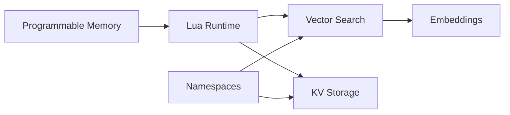
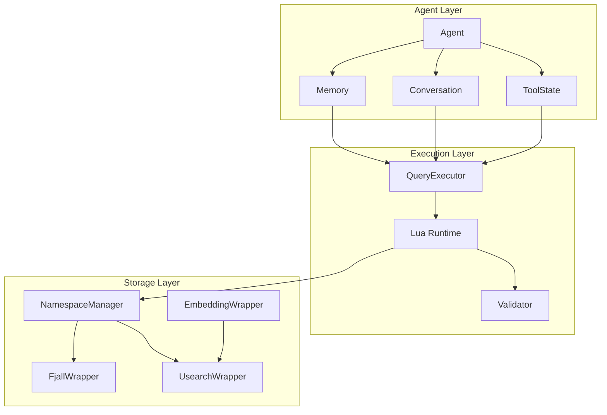

# Core Concepts

Understanding Liath's core concepts will help you build more effective AI agents and leverage the full power of programmable memory.

## Overview

Liath is built around several key concepts that work together to provide a powerful foundation for AI agent development:



## Core Concepts

### Programmable Memory

The fundamental innovation in Liath. Instead of fixed APIs, agents write Lua programs to implement custom retrieval strategies.

[:octicons-arrow-right-24: Learn about Programmable Memory](programmable-memory.md)

### Architecture

Understand how Liath's components work together - from the storage layer to the Lua runtime.

[:octicons-arrow-right-24: Explore Architecture](architecture.md)

### Namespaces

Logical isolation for data, allowing multiple agents or applications to share a database safely.

[:octicons-arrow-right-24: Understand Namespaces](namespaces.md)

### Vector Search

HNSW-based similarity search that powers semantic retrieval across your data.

[:octicons-arrow-right-24: Learn Vector Search](vector-search.md)

### Embeddings

Text-to-vector transformation that enables semantic understanding of your data.

[:octicons-arrow-right-24: Explore Embeddings](embeddings.md)

## Key Principles

### 1. Agents Write Code, Not Just Queries

Traditional databases require you to anticipate every query pattern upfront. Liath lets agents generate code at runtime to implement exactly the retrieval strategy they need.

```lua
-- Agent decides HOW to retrieve based on context
local function retrieve_for_task(task_type, query)
    if task_type == "urgent" then
        -- Prioritize recent, high-importance memories
        return weighted_search(query, {recency = 2.0, importance = 1.5})
    else
        -- Standard semantic search
        return semantic_search("memory", query, 5)
    end
end
```

### 2. Safety Through Sandboxing

All agent-generated code runs in a secure Lua sandbox. System access is completely blocked:

- No file system access
- No network access
- No OS commands
- No loading external code

### 3. Persistence by Default

Everything is persisted automatically:

- Agent metadata
- Memories with embeddings
- Conversation history
- Tool state
- Vector indices

### 4. Embedding-First Design

Text is automatically embedded for semantic search. You don't need to manage vectors manually unless you want to.

### 5. Namespace Isolation

Data is isolated by namespace, enabling:

- Multi-tenant applications
- Per-agent data isolation
- Logical data organization

## How Concepts Connect



## Comparison with Traditional Approaches

| Aspect | Traditional DB | Vector DB | Liath |
|--------|---------------|-----------|-------|
| Query Language | SQL | Fixed API | Lua (programmable) |
| Ranking | Single metric | Similarity only | Multi-factor, custom |
| Data Model | Relational | Documents + Vectors | KV + Vectors + Agent State |
| Agent Support | None | Limited | First-class |
| Code Execution | No | No | Safe sandbox |

## Next Steps

- [Programmable Memory](programmable-memory.md) - Deep dive into the core innovation
- [Architecture](architecture.md) - Technical system design
- [Guides](../guides/index.md) - Practical how-to guides
