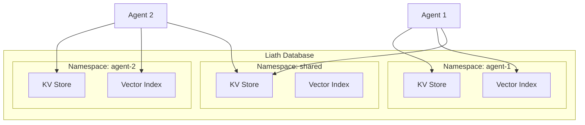

# Namespaces

Namespaces provide logical isolation for data in Liath, enabling multi-tenant applications, per-agent data separation, and organized data management.

## Overview

A namespace in Liath is an isolated data container with:

- Its own key-value store partition
- An optional vector index
- Independent lifecycle management



## Creating Namespaces

### Basic Creation

```rust
use liath::EmbeddedLiath;
use usearch::{MetricKind, ScalarKind};

let db = EmbeddedLiath::new(Config::default())?;

// Create namespace with vector index
db.create_namespace(
    "documents",       // Name
    384,               // Vector dimensions
    MetricKind::Cos,   // Distance metric
    ScalarKind::F32    // Scalar type
)?;
```

### Via Lua

```lua
-- Create from Lua code
create_namespace("my_namespace", 384, "cosine", "f32")

-- List all namespaces
local namespaces = list_namespaces()
for _, ns in ipairs(namespaces) do
    print(ns)
end
```

### Agent Namespaces

When using the Agent API, namespaces are created automatically with a naming convention:

```
agent:{agent_id}:memory    -- Agent's long-term memory
agent:{agent_id}:conv:{id} -- Conversation data
agent:{agent_id}:tools     -- Tool state
```

## Namespace Configuration

### Distance Metrics

| Metric | Constant | Description | Best For |
|--------|----------|-------------|----------|
| Cosine | `MetricKind::Cos` | Measures angle between vectors | Text embeddings |
| Euclidean | `MetricKind::L2sq` | Measures absolute distance | Image features |
| Inner Product | `MetricKind::IP` | Dot product similarity | Pre-normalized vectors |

### Scalar Types

| Type | Constant | Size | Precision | Use Case |
|------|----------|------|-----------|----------|
| Float32 | `ScalarKind::F32` | 4 bytes | High | Default, best accuracy |
| Float16 | `ScalarKind::F16` | 2 bytes | Medium | Memory constrained |
| Int8 | `ScalarKind::I8` | 1 byte | Low | Large scale |

### Choosing Parameters

```rust
// For text semantic search (recommended)
db.create_namespace("text_docs", 384, MetricKind::Cos, ScalarKind::F32)?;

// For memory-constrained environments
db.create_namespace("large_corpus", 384, MetricKind::Cos, ScalarKind::F16)?;

// For image similarity
db.create_namespace("images", 512, MetricKind::L2sq, ScalarKind::F32)?;
```

## Working with Namespaces

### Listing Namespaces

```rust
// Rust
let namespaces = db.list_namespaces();
for ns in namespaces {
    println!("Namespace: {}", ns);
}
```

```lua
-- Lua
local namespaces = list_namespaces()
return json.encode(namespaces)
```

### Checking Existence

```rust
if db.namespace_exists("my_namespace") {
    println!("Namespace exists");
}
```

### Deleting Namespaces

```rust
// Rust
db.delete_namespace("old_namespace")?;
```

```lua
-- Lua
delete_namespace("old_namespace")
```

!!! danger "Deletion is Permanent"
    Deleting a namespace removes all data including the KV store and vector index.
    This operation cannot be undone.

## Data Operations by Namespace

### Key-Value Operations

```rust
// Explicit namespace
db.put("my_namespace", b"key", b"value")?;
let value = db.get("my_namespace", b"key")?;
db.delete("my_namespace", b"key")?;

// Current namespace (after set_namespace)
db.set_namespace("my_namespace");
db.put_current(b"key", b"value")?;
```

### Vector Operations

```rust
// Add vector to specific namespace
let embedding = db.generate_embedding("Hello world")?;
db.add_vector("documents", 1, &embedding)?;

// Search in namespace
let results = db.search_vectors("documents", &query_vec, 10)?;
```

### Semantic Operations

```rust
// Store with automatic embedding
db.store_with_embedding("documents", 1, b"doc:1", "Document content")?;

// Semantic search
let results = db.semantic_search("documents", "search query", 5)?;
```

## Namespace Patterns

### Per-Agent Isolation

Each agent gets its own namespace for complete data isolation:

```rust
fn create_agent_namespace(db: &EmbeddedLiath, agent_id: &str) -> Result<()> {
    let ns_name = format!("agent:{}", agent_id);

    #[cfg(feature = "vector")]
    db.create_namespace(&ns_name, 384, MetricKind::Cos, ScalarKind::F32)?;

    Ok(())
}
```

### Shared Knowledge Base

Multiple agents can share a common knowledge namespace:

```lua
-- Agent 1 writes to shared namespace
store_with_embedding("shared:knowledge", id(), "Shared fact")

-- Agent 2 reads from shared namespace
local facts = semantic_search("shared:knowledge", "query", 5)
```

### Data Type Separation

Separate namespaces for different data types:

```rust
// Create specialized namespaces
db.create_namespace("memories", 384, MetricKind::Cos, ScalarKind::F32)?;
db.create_namespace("documents", 384, MetricKind::Cos, ScalarKind::F32)?;
db.create_namespace("conversations", 384, MetricKind::Cos, ScalarKind::F32)?;
db.create_namespace("embeddings_only", 384, MetricKind::Cos, ScalarKind::F16)?;
```

### Temporal Partitioning

Separate namespaces by time period:

```lua
local function get_current_namespace()
    local date = os.date("*t")
    return string.format("logs:%d:%02d", date.year, date.month)
end

-- Store in current month's namespace
local ns = get_current_namespace()
put(ns, id(), json.encode(log_entry))
```

## Namespace Metadata

### Accessing Metadata

```rust
pub struct NamespaceMetadata {
    pub name: String,
    pub dimensions: usize,
    pub metric: String,
    pub scalar: String,
}

// Access via namespace manager (internal API)
let metadata = namespace_manager.get_metadata("my_namespace")?;
```

## Persistence

### Automatic Persistence

Namespaces are automatically persisted to the data directory:

```
data_dir/
└── namespaces/
    ├── documents/
    │   ├── kv/              # Fjall KV store
    │   └── vectors.idx      # USearch index
    └── memories/
        ├── kv/
        └── vectors.idx
```

### Manual Save

Force a save of specific namespace:

```rust
db.save_namespace("documents")?;

// Or save all
db.save()?;
```

## Best Practices

### 1. Use Descriptive Names

```rust
// Good
db.create_namespace("user_profiles", ...)?;
db.create_namespace("product_catalog", ...)?;

// Avoid
db.create_namespace("ns1", ...)?;
db.create_namespace("data", ...)?;
```

### 2. Plan Namespace Strategy Early

Consider your data isolation needs upfront:

- Multi-tenant: One namespace per tenant
- Multi-agent: Namespaces per agent + shared
- Single application: Namespaces by data type

### 3. Match Dimensions to Model

Always ensure namespace dimensions match your embedding model:

```rust
// If using BGE-small (384 dimensions)
db.create_namespace("docs", 384, ...)?;

// If using BGE-base (768 dimensions)
db.create_namespace("docs", 768, ...)?;
```

### 4. Consider Memory vs Accuracy Trade-offs

```rust
// High accuracy (default)
db.create_namespace("critical", 384, MetricKind::Cos, ScalarKind::F32)?;

// Memory efficient (50% savings)
db.create_namespace("bulk_logs", 384, MetricKind::Cos, ScalarKind::F16)?;
```

## Next Steps

- [Vector Search](vector-search.md) - Deep dive into similarity search
- [Embeddings](embeddings.md) - Text embedding configuration
- [Architecture](architecture.md) - System design overview
