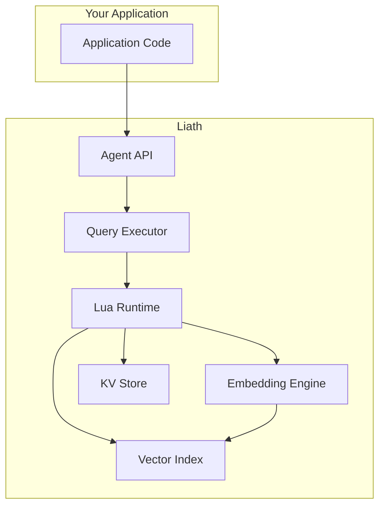

# Getting Started

Welcome to Liath! This section will guide you through installing Liath, understanding its core concepts, and building your first AI agent with programmable memory.

## What is Liath?

Liath is **The SQLite for AI Agents** - an embedded database designed specifically for AI agent workloads. Unlike traditional databases, Liath allows agents to write programs (in Lua) to query their own memory, enabling sophisticated retrieval strategies that go far beyond simple similarity search.

## Key Features

| Feature | Description |
|---------|-------------|
| **Programmable Memory** | Agents write Lua code to implement custom retrieval strategies |
| **Embedded Database** | Zero-config, single dependency, no server required |
| **Vector Search** | Built-in HNSW indices for fast semantic search |
| **Agent API** | First-class support for memory, conversations, and tool state |
| **Safe Execution** | Sandboxed Lua runtime blocks all system access |
| **Multiple Integrations** | HTTP API, MCP protocol, Python bindings |

## Quick Navigation

-   :material-download:{ .lg .middle } **Installation**

    ---

    Install Liath in your Rust project with cargo

    [:octicons-arrow-right-24: Install now](installation.md)

-   :material-clock-fast:{ .lg .middle } **Quick Start**

    ---

    Learn the basics in 5 minutes

    [:octicons-arrow-right-24: Quick start](quick-start.md)

-   :material-robot:{ .lg .middle } **First Agent**

    ---

    Build your first AI agent with persistent memory

    [:octicons-arrow-right-24: Build an agent](first-agent.md)

-   :material-cog:{ .lg .middle } **Configuration**

    ---

    Configure Liath for your use case

    [:octicons-arrow-right-24: Configuration](configuration.md)

## System Requirements

- **Rust**: 1.70 or later
- **OS**: Linux, macOS, or Windows
- **Memory**: 512MB minimum (more for large embedding models)
- **Disk**: Varies based on data stored

## Architecture Overview

## Choosing Your Path

### I want to...

=== "Build an AI Agent"

    Start with the [First Agent](first-agent.md) tutorial to learn how to:

    - Create agents with persistent memory
    - Store and recall semantic memories
    - Manage conversation history
    - Use tool state for stateful tools

=== "Add Semantic Search"

    Check out the [Quick Start](quick-start.md) to learn:

    - Storing documents with embeddings
    - Performing semantic search
    - Using the vector index

=== "Run a Database Server"

    See the [HTTP Server](../integrations/http-server.md) guide for:

    - Starting the REST API server
    - Available endpoints
    - Authentication setup

=== "Integrate with Claude/GPT"

    Read the [MCP Server](../integrations/mcp-server.md) docs to:

    - Enable MCP protocol support
    - Available tools for AI assistants
    - Configuration options

## Next Steps

1. **[Install Liath](installation.md)** - Add Liath to your project
2. **[Quick Start](quick-start.md)** - Learn basic operations
3. **[First Agent](first-agent.md)** - Build a complete agent
4. **[Core Concepts](../concepts/index.md)** - Deep dive into how Liath works
