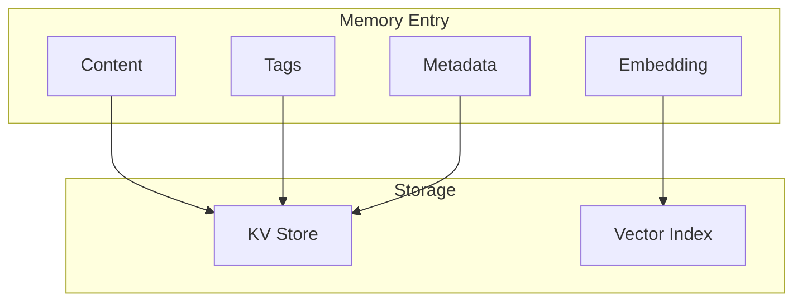

# Memory Patterns

This guide covers patterns and best practices for organizing, storing, and retrieving agent memories in Liath.

## Memory Architecture

Agent memory in Liath consists of:

1. **Content**: The actual memory text
2. **Embedding**: Vector representation for semantic search
3. **Tags**: Categorical labels for organization
4. **Metadata**: Additional structured information



## Basic Memory Operations

### Storing Memories

```rust
let memory = agent.memory()?;

// Store with tags
memory.store(
    "User prefers dark mode in all applications",
    &["preferences", "ui", "settings"]
)?;

// Store without tags
memory.store("Important meeting at 3pm tomorrow", &[])?;
```

### Recalling Memories

```rust
// Semantic recall
let results = memory.recall("What UI preferences does the user have?", 5)?;

// Tag-based recall
let preferences = memory.recall_by_tags(&["preferences"], 10)?;
```

## Memory Organization Strategies

### 1. Categorical Tagging

Organize memories by type:

```rust
// User information
memory.store("User's name is Alice", &["user", "profile", "identity"])?;
memory.store("User works at TechCorp", &["user", "profile", "work"])?;

// Preferences
memory.store("Prefers concise explanations", &["preferences", "communication"])?;
memory.store("Likes code examples in Python", &["preferences", "programming"])?;

// Facts learned
memory.store("Earth is 4.5 billion years old", &["facts", "science"])?;

// Interactions
memory.store("Discussed Rust async patterns", &["interactions", "topics", "rust"])?;
```

### 2. Temporal Organization

Track when memories were created:

```lua
local function store_with_timestamp(content, tags)
    local id = id()
    store_memory("memory", content, tags)

    put("memory:meta", id, json.encode({
        timestamp = now(),
        age_days = 0
    }))

    return id
end
```

### 3. Importance Scoring

Assign importance to memories:

```lua
local function store_important(content, tags, importance)
    local id = id()
    store_memory("memory", content, tags)

    put("memory:meta", id, json.encode({
        importance = importance,  -- 0.0 to 1.0
        timestamp = now()
    }))

    return id
end

-- Usage
store_important("User's birthday is March 15", {"user", "dates"}, 0.9)
store_important("User mentioned liking coffee", {"user", "preferences"}, 0.3)
```

### 4. Source Tracking

Track where memories came from:

```lua
local function store_from_source(content, tags, source)
    local id = id()
    store_memory("memory", content, tags)

    put("memory:meta", id, json.encode({
        source = source,
        timestamp = now(),
        verified = source == "user_stated"
    }))

    return id
end

-- Sources
store_from_source("User knows Python", {"skills"}, "user_stated")
store_from_source("User might know Java", {"skills"}, "inferred")
store_from_source("Project uses PostgreSQL", {"context"}, "document")
```

## Advanced Retrieval Patterns

### Multi-Factor Ranking

Combine multiple signals for better retrieval:

```lua
local function smart_recall(query, limit)
    -- Get candidate memories
    local results = semantic_search("memory", query, limit * 3)

    local scored = {}
    for _, r in ipairs(results) do
        local meta = json.decode(get("memory:meta", r.id) or '{}')

        -- Calculate component scores
        local relevance = 1 - r.distance
        local importance = meta.importance or 0.5

        -- Recency decay: older memories get lower scores
        local age_days = meta.age_days or 30
        local recency = math.exp(-age_days / 30)  -- Decay over 30 days

        -- Source trust
        local trust = 1.0
        if meta.source == "user_stated" then
            trust = 1.0
        elseif meta.source == "inferred" then
            trust = 0.7
        elseif meta.source == "document" then
            trust = 0.9
        end

        -- Combined score
        local score = relevance * importance * recency * trust

        table.insert(scored, {
            id = r.id,
            content = r.content,
            score = score,
            factors = {
                relevance = relevance,
                importance = importance,
                recency = recency,
                trust = trust
            }
        })
    end

    -- Sort by score
    table.sort(scored, function(a, b) return a.score > b.score end)

    -- Return top results
    local top = {}
    for i = 1, math.min(limit, #scored) do
        table.insert(top, scored[i])
    end
    return top
end
```

### Context-Aware Retrieval

Adjust retrieval strategy based on context:

```lua
local function contextual_recall(query, context_type)
    if context_type == "coding_help" then
        -- Prioritize technical memories
        local results = recall("memory", query, 10)
        return filter(results, function(r)
            local meta = json.decode(get("memory:meta", r.id) or '{}')
            return has_tag(meta.tags or {}, "programming") or
                   has_tag(meta.tags or {}, "technical")
        end)

    elseif context_type == "personal_chat" then
        -- Prioritize user preferences and history
        local prefs = recall_by_tags("memory", {"preferences"}, 5)
        local relevant = recall("memory", query, 5)
        return merge_unique(prefs, relevant)

    elseif context_type == "task_execution" then
        -- Prioritize recent, high-importance memories
        local results = smart_recall(query, 10)
        return filter(results, function(r)
            return r.factors.recency > 0.5 and r.factors.importance > 0.5
        end)
    end

    return recall("memory", query, 10)
end
```

### Cross-Reference Search

Find related memories:

```lua
local function find_related(memory_id, limit)
    -- Get the source memory
    local content = get("memory", memory_id)
    if not content then return {} end

    -- Search for related
    local results = semantic_search("memory", content, limit + 1)

    -- Filter out the source memory
    return filter(results, function(r) return r.id ~= memory_id end)
end

-- Usage: expand context
local function expand_context(seed_memories, depth, limit)
    local expanded = {}
    local seen = {}

    for _, mem in ipairs(seed_memories) do
        seen[mem.id] = true
        table.insert(expanded, mem)
    end

    for d = 1, depth do
        local new_memories = {}
        for _, mem in ipairs(expanded) do
            local related = find_related(mem.id, 3)
            for _, r in ipairs(related) do
                if not seen[r.id] then
                    seen[r.id] = true
                    table.insert(new_memories, r)
                end
            end
        end
        for _, m in ipairs(new_memories) do
            table.insert(expanded, m)
        end
    end

    return slice(expanded, 1, limit)
end
```

## Memory Lifecycle Management

### Memory Consolidation

Summarize and compress old memories:

```lua
local function consolidate_memories(tag, older_than_days)
    -- Get old memories with tag
    local all_mems = recall_by_tags("memory", {tag}, 100)

    local old_mems = filter(all_mems, function(m)
        local meta = json.decode(get("memory:meta", m.id) or '{}')
        return (meta.age_days or 0) > older_than_days
    end)

    if #old_mems < 5 then return end  -- Not enough to consolidate

    -- Create summary (in real use, call LLM)
    local contents = map(old_mems, function(m) return m.content end)
    local summary = "Consolidated: " .. table.concat(contents, "; ")

    -- Store consolidated memory
    store_important(summary, {tag, "consolidated"}, 0.8)

    -- Mark old as archived (or delete)
    for _, m in ipairs(old_mems) do
        local meta = json.decode(get("memory:meta", m.id) or '{}')
        meta.archived = true
        put("memory:meta", m.id, json.encode(meta))
    end
end
```

### Memory Decay

Reduce importance of unused memories:

```lua
local function apply_decay()
    local all_keys = keys("memory:meta")

    for _, key in ipairs(all_keys) do
        local meta = json.decode(get("memory:meta", key) or '{}')

        -- Increase age
        meta.age_days = (meta.age_days or 0) + 1

        -- Decay importance if not accessed
        if not meta.last_accessed or
           (now() - meta.last_accessed) > 7 * 24 * 3600 then
            meta.importance = (meta.importance or 0.5) * 0.95
        end

        put("memory:meta", key, json.encode(meta))
    end
end
```

### Memory Refresh

Boost memories when accessed:

```lua
local function recall_with_refresh(query, limit)
    local results = smart_recall(query, limit)

    -- Refresh accessed memories
    for _, r in ipairs(results) do
        local meta = json.decode(get("memory:meta", r.id) or '{}')
        meta.last_accessed = now()
        meta.access_count = (meta.access_count or 0) + 1

        -- Slight importance boost for frequently accessed
        if meta.access_count > 5 then
            meta.importance = math.min(1.0, (meta.importance or 0.5) + 0.01)
        end

        put("memory:meta", r.id, json.encode(meta))
    end

    return results
end
```

## Tag Taxonomy

### Recommended Tag Categories

| Category | Example Tags | Purpose |
|----------|--------------|---------|
| Entity | `user`, `project`, `company` | What the memory is about |
| Type | `fact`, `preference`, `interaction` | Kind of memory |
| Domain | `programming`, `personal`, `work` | Subject area |
| Status | `current`, `historical`, `tentative` | Validity |
| Source | `stated`, `inferred`, `observed` | Origin |

### Tag Hierarchy

```lua
-- Use prefixes for hierarchy
local tags = {
    "entity:user",
    "entity:user:preferences",
    "type:fact",
    "domain:programming",
    "domain:programming:rust"
}

-- Query with hierarchy
local function recall_hierarchical(base_tag, query, limit)
    -- Get all tags starting with base
    local all_mems = recall("memory", query, limit * 2)

    return filter(all_mems, function(m)
        local meta = json.decode(get("memory:meta", m.id) or '{}')
        for _, tag in ipairs(meta.tags or {}) do
            if string.find(tag, "^" .. base_tag) then
                return true
            end
        end
        return false
    end)
end
```

## Best Practices

### 1. Be Specific in Content

```lua
-- Bad: vague
memory.store("User likes programming", &["preferences"])?;

-- Good: specific
memory.store("User prefers Rust for systems programming, citing memory safety as the main reason", &["preferences", "programming", "rust"])?;
```

### 2. Use Consistent Tags

```lua
-- Create a tag vocabulary
local TAGS = {
    user_profile = {"user", "profile"},
    user_pref = {"user", "preferences"},
    tech_skill = {"skills", "technical"},
    interaction = {"history", "interaction"}
}

-- Use consistently
store_memory("memory", "User knows Python", TAGS.tech_skill)
```

### 3. Include Context

```lua
-- Bad: no context
memory.store("The deadline is Friday", &["work"])?;

-- Good: full context
memory.store("Project Alpha deadline is Friday, March 15th - user mentioned feeling stressed about it", &["work", "deadlines", "project-alpha"])?;
```

### 4. Regular Maintenance

```lua
-- Run periodically
local function maintain_memories()
    apply_decay()
    consolidate_memories("interactions", 30)
    cleanup_low_importance(0.1)
end
```

## Next Steps

- [Building AI Agents](building-agents.md) - Use memories in agents
- [Conversation Management](conversations.md) - Link memories to conversations
- [Lua Scripting](lua-scripting.md) - Advanced retrieval functions
