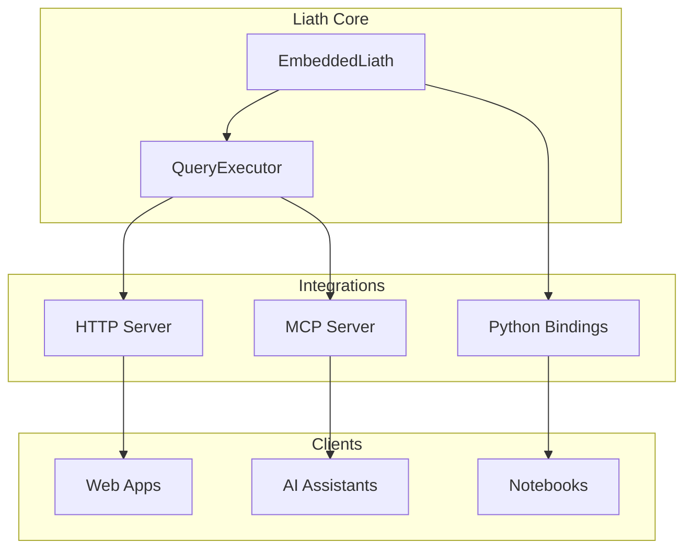

# Integrations

Liath provides multiple integration options beyond the core embedded library.

## Available Integrations

<div class="grid cards" markdown>

-   :material-api:{ .lg .middle } **HTTP Server**

    ---

    RESTful API for external access to Liath

    [:octicons-arrow-right-24: HTTP Server](http-server.md)

-   :material-robot:{ .lg .middle } **MCP Server**

    ---

    Model Context Protocol for AI assistant integration

    [:octicons-arrow-right-24: MCP Server](mcp-server.md)

-   :material-language-python:{ .lg .middle } **Python Bindings**

    ---

    Use Liath from Python applications

    [:octicons-arrow-right-24: Python](python.md)

</div>

## Feature Flags

Enable integrations via Cargo feature flags:

```toml
[dependencies]
# HTTP server
liath = { version = "0.1", features = ["server"] }

# MCP server
liath = { version = "0.1", features = ["mcp"] }

# Python bindings
liath = { version = "0.1", features = ["python"] }

# All integrations
liath = { version = "0.1", features = ["server", "mcp", "python"] }
```

## Integration Comparison

| Feature | HTTP Server | MCP Server | Python |
|---------|-------------|------------|--------|
| Use Case | Web apps, microservices | AI assistants | Data science |
| Protocol | REST/JSON | JSON-RPC stdio | Native Python |
| Auth | API keys | Host process | N/A |
| Async | Yes | Yes | Yes (tokio) |
| Full API | Yes | Subset | Subset |

## Choosing an Integration

### HTTP Server

Best for:

- Web applications
- Microservice architectures
- Multi-language environments
- External API access

```bash
# Start server
liath server --host 0.0.0.0 --port 8080
```

### MCP Server

Best for:

- Claude Desktop integration
- AI assistant tools
- LLM function calling
- Chatbot backends

```bash
# Configure in Claude Desktop
liath mcp
```

### Python Bindings

Best for:

- Data science workflows
- Jupyter notebooks
- Python applications
- ML pipelines

```python
from liath import Liath

db = Liath("./data")
db.store_with_embedding("docs", "d1", "Hello world")
```

## Architecture



## Next Steps

- [HTTP Server](http-server.md) - Deploy a REST API
- [MCP Server](mcp-server.md) - Integrate with AI assistants
- [Python Bindings](python.md) - Use from Python
